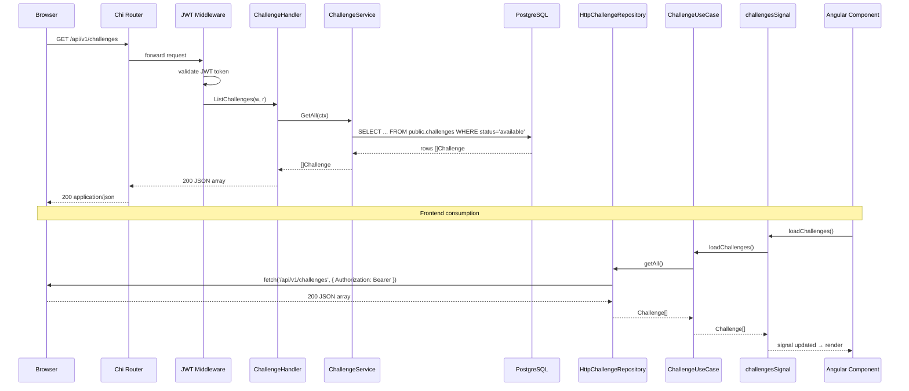
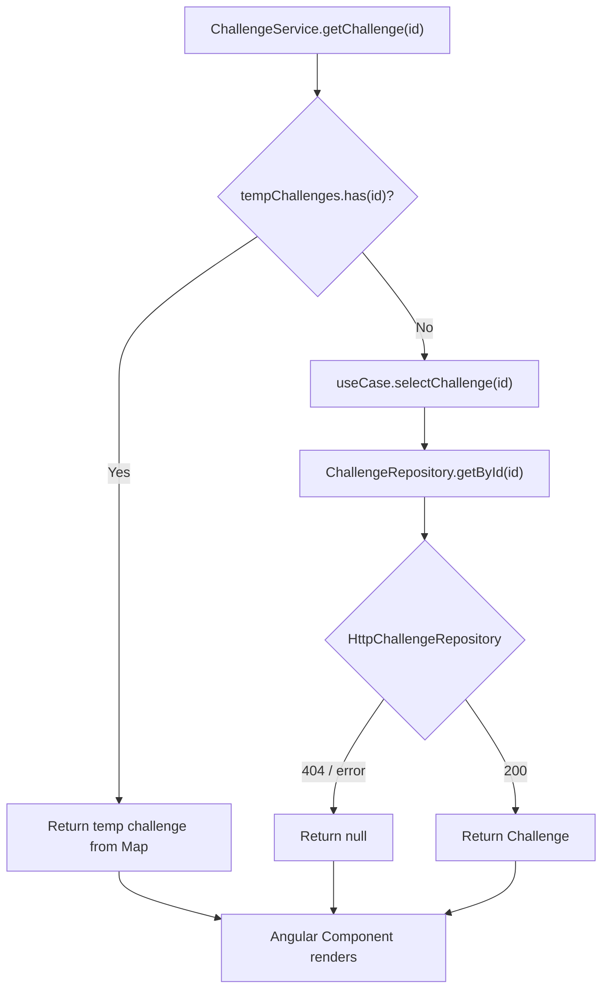

# Design: Migrate Challenges from Mock Data to PostgreSQL

## Technical Approach

Replace `MockChallengeRepository` with `HttpChallengeRepository` in the frontend. Add Go backend layer (domain model → service → handler → routes) backed by raw SQL against `public.challenges` table in Supabase PostgreSQL. Follow existing hexagonal patterns exactly.

## Architecture Decisions

### Decision: Raw SQL over ORM

| Option | Tradeoff | Decision |
|--------|----------|----------|
| `database/sql` + `lib/pq` | More boilerplate, zero dependency | **Chosen** — matches AuditHistoryService, UserProgressService |
| GORM/sqlc | Less boilerplate, new dependency | Rejected — inconsistent with existing codebase |

**Rationale**: `AuditHistoryService` and `UserProgressService` both use `*sql.DB` directly. Adding an ORM introduces a new dependency and learning curve for no benefit — the challenge queries are simple SELECTs.

### Decision: `fetch` API over Angular `HttpClient`

| Option | Tradeoff | Decision |
|--------|----------|----------|
| Native `fetch` + manual `Authorization` header | Manual token wiring, but works | **Chosen** — fixes pre-existing auth gap |
| Angular `HttpClient` | Cleaner API, interceptors | Rejected — existing services using HttpClient don't send JWT (pre-existing bug) |

**Rationale**: `AuthService` already uses `fetch` with manual `Authorization: Bearer <token>`. `HttpClient` services in this project don't wire the JWT header. Using `fetch` is consistent and correct.

## Database Schema

```sql
CREATE TABLE public.challenges (
    id UUID PRIMARY KEY DEFAULT gen_random_uuid(),
    title TEXT NOT NULL,
    description TEXT NOT NULL,
    difficulty TEXT NOT NULL CHECK (difficulty IN ('junior','mid','senior','architect')),
    category TEXT NOT NULL,
    language TEXT NOT NULL,
    repo_url TEXT NOT NULL,
    code TEXT NOT NULL,
    code_smell TEXT NOT NULL,
    status TEXT NOT NULL DEFAULT 'available' CHECK (status IN ('available')),
    created_at TIMESTAMPTZ NOT NULL DEFAULT NOW()
);
CREATE INDEX idx_challenges_created ON public.challenges(created_at DESC);
ALTER TABLE public.challenges ENABLE ROW LEVEL SECURITY;
CREATE POLICY "Authenticated users can view challenges" ON public.challenges
    FOR SELECT TO authenticated USING (true);
```

## File Changes

| File | Action | Description |
|------|--------|-------------|
| `backend/internal/core/domain/models/challenge_models.go` | Create | Go domain model with `json:"camelCase"` tags |
| `backend/internal/core/services/challenge_service.go` | Create | Service with `GetAll`, `GetByID` |
| `backend/internal/infrastructure/driving/handlers/challenge_handler.go` | Create | HTTP handler with `ListChallenges`, `GetChallenge` |
| `backend/cmd/api/main.go` | Modify | Wire challenge service + handler, register `/api/v1/challenges` routes |
| `backend/internal/infrastructure/driven/supabase/migrations/003_create_challenges.sql` | Create | Table schema + RLS |
| `backend/internal/infrastructure/driven/supabase/migrations/003_seed_challenges.sql` | Create | Idempotent seed of 8 mock challenges |
| `frontend/codeauditor/src/app/infrastructure/repositories/http-challenge.repository.ts` | Create | `fetch`-based repository |
| `frontend/codeauditor/src/app/infrastructure/services/challenge.service.ts` | Modify | Inject `HttpChallengeRepository`, preserve `tempChallenges` |

## Interfaces / Contracts

### Go Domain Model — `challenge_models.go`

```go
package models

import "time"

// Challenge represents a code-audit challenge.
type Challenge struct {
	ID          string    `json:"id"`
	Title       string    `json:"title"`
	Description string    `json:"description"`
	Difficulty  string    `json:"difficulty"`
	Category    string    `json:"category"`
	Language    string    `json:"language"`
	RepoURL     string    `json:"repoUrl"`
	Code        string    `json:"code"`
	CodeSmell   string    `json:"codeSmell"`
	Status      string    `json:"status"`
	CreatedAt   time.Time `json:"createdAt"`
}
```

### Go Service — `challenge_service.go`

```go
package services

import (
	"context"
	"database/sql"
	"errors"

	"github.com/anomalyco/codeauditor/backend/internal/core/domain/models"
)

var ErrChallengeNotFound = errors.New("challenge not found")

// ChallengeService retrieves challenges from PostgreSQL.
type ChallengeService struct {
	db *sql.DB
}

// NewChallengeService creates a new ChallengeService.
func NewChallengeService(db *sql.DB) *ChallengeService {
	return &ChallengeService{db: db}
}

// GetAll returns all challenges with status='available', ordered by created_at DESC.
func (s *ChallengeService) GetAll(ctx context.Context) ([]models.Challenge, error) {
	rows, err := s.db.QueryContext(ctx,
		`SELECT id, title, description, difficulty, category, language, repo_url, code, code_smell, status, created_at
		 FROM public.challenges
		 WHERE status = 'available'
		 ORDER BY created_at DESC`,
	)
	if err != nil {
		return nil, err
	}
	defer rows.Close()

	var challenges []models.Challenge
	for rows.Next() {
		var c models.Challenge
		if err := rows.Scan(&c.ID, &c.Title, &c.Description, &c.Difficulty, &c.Category, &c.Language, &c.RepoURL, &c.Code, &c.CodeSmell, &c.Status, &c.CreatedAt); err != nil {
			return nil, err
		}
		challenges = append(challenges, c)
	}
	return challenges, rows.Err()
}

// GetByID returns a single challenge by ID, or ErrChallengeNotFound.
func (s *ChallengeService) GetByID(ctx context.Context, id string) (models.Challenge, error) {
	var c models.Challenge
	err := s.db.QueryRowContext(ctx,
		`SELECT id, title, description, difficulty, category, language, repo_url, code, code_smell, status, created_at
		 FROM public.challenges
		 WHERE id = $1 AND status = 'available'`,
		id,
	).Scan(&c.ID, &c.Title, &c.Description, &c.Difficulty, &c.Category, &c.Language, &c.RepoURL, &c.Code, &c.CodeSmell, &c.Status, &c.CreatedAt)
	if err != nil {
		if errors.Is(err, sql.ErrNoRows) {
			return models.Challenge{}, ErrChallengeNotFound
		}
		return models.Challenge{}, err
	}
	return c, nil
}
```

### Go Handler — `challenge_handler.go`

```go
package handlers

import (
	"encoding/json"
	"errors"
	"net/http"
	"strings"

	"github.com/anomalyco/codeauditor/backend/internal/core/services"
)

// ChallengeHandler handles challenge HTTP endpoints.
type ChallengeHandler struct {
	service *services.ChallengeService
}

// NewChallengeHandler creates a new ChallengeHandler.
func NewChallengeHandler(service *services.ChallengeService) *ChallengeHandler {
	return &ChallengeHandler{service: service}
}

// ListChallenges handles GET /api/v1/challenges.
func (h *ChallengeHandler) ListChallenges(w http.ResponseWriter, r *http.Request) {
	challenges, err := h.service.GetAll(r.Context())
	if err != nil {
		http.Error(w, "Failed to load challenges", http.StatusInternalServerError)
		return
	}

	if challenges == nil {
		challenges = []models.Challenge{}
	}

	w.Header().Set("Content-Type", "application/json")
	_ = json.NewEncoder(w).Encode(challenges)
}

// GetChallenge handles GET /api/v1/challenges/{id}.
func (h *ChallengeHandler) GetChallenge(w http.ResponseWriter, r *http.Request) {
	id := strings.TrimPrefix(r.URL.Path, "/api/v1/challenges/")
	if id == "" {
		http.Error(w, "Missing challenge ID", http.StatusBadRequest)
		return
	}

	challenge, err := h.service.GetByID(r.Context(), id)
	if err != nil {
		if errors.Is(err, services.ErrChallengeNotFound) {
			w.Header().Set("Content-Type", "application/json")
			w.WriteHeader(http.StatusNotFound)
			_ = json.NewEncoder(w).Encode(map[string]string{"error": "Challenge not found"})
			return
		}
		http.Error(w, "Failed to load challenge", http.StatusInternalServerError)
		return
	}

	w.Header().Set("Content-Type", "application/json")
	_ = json.NewEncoder(w).Encode(challenge)
}
```

### Route Registration — `main.go` (addition)

```go
// After historyService initialization, add:
challengeService := services.NewChallengeService(db)
challengeHandler := handlers.NewChallengeHandler(challengeService)
log.Println("Challenge service initialized")

// Inside r.Route("/api/v1", ...) block, add:
r.Get("/challenges", challengeHandler.ListChallenges)
r.Get("/challenges/{id}", challengeHandler.GetChallenge)
```

### Frontend HttpChallengeRepository — `http-challenge.repository.ts`

```typescript
import { Challenge } from '../../domain/models/challenge';
import { ChallengeRepository } from '../../domain/ports/challenge-repository.port';

export interface TokenProvider {
  getToken(): string | null;
}

export class HttpChallengeRepository implements ChallengeRepository {
  private readonly baseUrl: string;
  private readonly tokenProvider: TokenProvider;

  constructor(tokenProvider: TokenProvider, baseUrl: string = '/api/v1') {
    this.baseUrl = baseUrl;
    this.tokenProvider = tokenProvider;
  }

  async getAll(): Promise<Challenge[]> {
    try {
      const token = this.tokenProvider.getToken();
      if (!token) return [];

      const resp = await fetch(`${this.baseUrl}/challenges`, {
        headers: { 'Authorization': `Bearer ${token}` },
      });
      if (!resp.ok) return [];
      return resp.json();
    } catch {
      return [];
    }
  }

  async getById(id: string): Promise<Challenge | null> {
    try {
      const token = this.tokenProvider.getToken();
      if (!token) return null;

      const resp = await fetch(`${this.baseUrl}/challenges/${id}`, {
        headers: { 'Authorization': `Bearer ${token}` },
      });
      if (resp.status === 404) return null;
      if (!resp.ok) return null;
      return resp.json();
    } catch {
      return null;
    }
  }
}
```

### Frontend Service Update — `challenge.service.ts` (modified)

```typescript
import { Injectable, signal } from '@angular/core';
import { ChallengeUseCase } from '../../application/challenge.use-case';
import { HttpChallengeRepository, TokenProvider } from '../repositories/http-challenge.repository';
import { Challenge } from '../../domain/models/challenge';

@Injectable({ providedIn: 'root' })
export class ChallengeService {
  private useCase: ChallengeUseCase;
  private tempChallenges = new Map<string, Challenge>();

  challengesSignal = signal<Challenge[]>([]);
  selectedChallengeSignal = signal<Challenge | null>(null);
  loadingSignal = signal(false);

  constructor(tokenProvider: TokenProvider) {
    this.useCase = new ChallengeUseCase(new HttpChallengeRepository(tokenProvider));
  }

  // loadChallenges, selectChallenge, getChallenge, addTempChallenge — unchanged
  async loadChallenges(): Promise<void> {
    this.loadingSignal.set(true);
    try {
      const challenges = await this.useCase.loadChallenges();
      this.challengesSignal.set(challenges);
    } finally {
      this.loadingSignal.set(false);
    }
  }

  async selectChallenge(id: string): Promise<void> {
    this.loadingSignal.set(true);
    try {
      const challenge = await this.getChallenge(id);
      this.selectedChallengeSignal.set(challenge);
    } finally {
      this.loadingSignal.set(false);
    }
  }

  async getChallenge(id: string): Promise<Challenge | null> {
    const temp = this.tempChallenges.get(id);
    if (temp) return temp;
    return this.useCase.selectChallenge(id);
  }

  addTempChallenge(challenge: Challenge): string {
    const id = `temp-${Date.now()}`;
    this.tempChallenges.set(id, { ...challenge, id });
    return id;
  }
}
```

## Data Flow

### Full Request Sequence



### tempChallenges Priority Flow



## Testing Strategy

| Layer | What to Test | Approach |
|-------|-------------|----------|
| Unit — Go Service | `GetAll` returns sorted challenges, `GetByID` returns `ErrChallengeNotFound` | `sqlmock` with fake `*sql.DB` |
| Unit — Go Handler | 200 with array, 404 with JSON error, nil→`[]` | `httptest.NewRecorder` |
| Unit — Frontend Repo | `getAll` returns `[]` on network error, `getById` returns `null` on 404 | `msw` mock fetch |
| Integration | Seed file idempotency, RLS policy | Run migration + seed against test Supabase |
| E2E | `GET /api/v1/challenges` with valid JWT returns 8 challenges | Cypress or Playwright |

## Migration / Rollout Plan

1. **Phase 1**: Create migration + seed files. Execute manually against Supabase.
2. **Phase 2**: Deploy backend files (model, service, handler, routes). Verify `GET /api/v1/challenges` returns 8 challenges.
3. **Phase 3**: Deploy frontend changes (`HttpChallengeRepository` + service wiring). Verify UI loads from HTTP.
4. **Rollback**: Revert `challenge.service.ts` to `MockChallengeRepository`, drop `public.challenges`, remove backend routes.

## Open Questions

- [ ] Should seed file use UUID string literals (e.g., `'ch-sqli'` cast to UUID) or rely on `gen_random_uuid()`? Spec says "original mock ID" — need `gen_random_uuid()` won't produce `ch-sqli`. **Decision**: Use explicit UUID casts like `'ch-sqli'::uuid` in seed file.
- [ ] Does Angular DI need `TokenProvider` as an injectable factory, or passed manually? **Decision**: Create `AuthService` adapter implementing `TokenProvider` — wire in `app.config.ts`.
