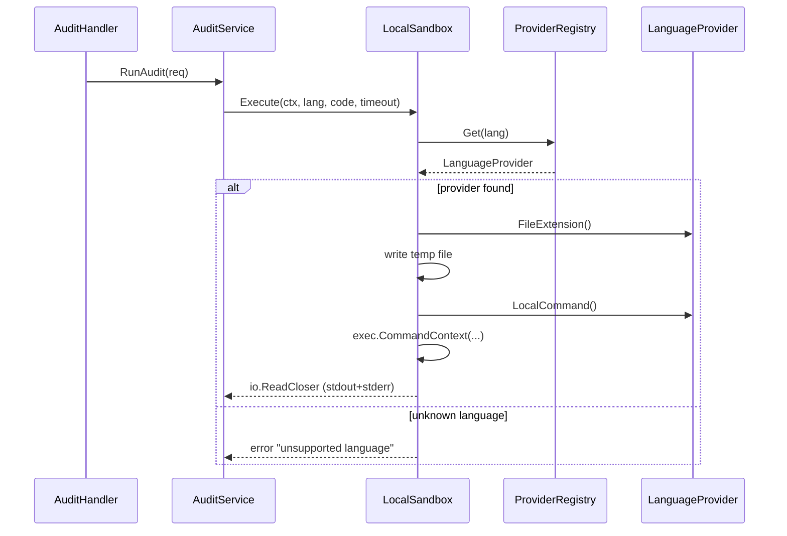

# Design: multi-lang-sandbox-oleada1

## Technical Approach

Replace the inline `switch language` in `LocalSandbox` and `DockerSandbox` with a **Provider Pattern** (Strategy + Registry). A `LanguageProvider` interface defines per-language behavior. A `ProviderRegistry` maps language keys to providers. Both sandbox implementations call `registry.Get(lang)` — a 2-line delegation replacing ~60 lines of switch logic. Each language lives in its own file under `providers/`. The pattern scales to 35+ languages across future oleadas without modifying existing sandbox code.

## Architecture Decisions

| Decision | Option | Tradeoff | Decision |
|----------|--------|----------|----------|
| Provider interface location | `ports/` vs `internal/core/provider/` | `ports/` keeps the hexagon pure (driven port); `core/` adds a layer. | `ports/provider.go` — it's a driven port, consistent with `ports/sandbox.go` |
| Provider files location | `sandbox/providers/` vs top-level `providers/` | Sandbox-specific providers vs shared. Only sandbox uses them. | `sandbox/providers/` — co-located with their consumer |
| Registry population | `main.go` vs `NewRegistry()` constructor | Explicit wiring vs magic init. `main.go` is standard Go DI. | `NewDefaultRegistry()` in `providers/registry.go` returning all 8 providers; called in `main.go` |
| Docker command contract | `DockerCommand(filename) []string` vs `DockerCmd + DockerArgs` | Single method simpler; split gives DockerSandbox more control over arg assembly. | Single `DockerCommand(filename) []string` — keeps providers self-contained |
| Healthcheck strategy | Per-sandbox union vs per-provider iteration | Union is simpler; per-provider gives granular reports. | Per-provider iteration with early-exit on Docker failure, non-fatal on missing local tools |
| Existing TS/JS/Go migration | Extract now vs defer | Extracting now unblocks future oleadas; deferring minimizes risk. | Extract now — 2 provider files + registry, part of this change |

## Data Flow



## Key Interfaces and Structs

### LanguageProvider (port)

```go
// ports/provider.go
package ports

type LanguageProvider interface {
    Language()      string
    FileExtension() string
    DockerImage()   string
    DockerCommand(filename string) []string
    LocalCommand()  string
    InstallHint()   string
}
```

### ProviderRegistry

```go
// infrastructure/driven/sandbox/providers/registry.go
package providers

type ProviderRegistry struct {
    providers map[string]ports.LanguageProvider
}

func NewDefaultRegistry() *ProviderRegistry {
    r := &ProviderRegistry{providers: make(map[string]ports.LanguageProvider)}
    r.Register(NewPythonProvider())
    r.Register(NewRubyProvider())
    r.Register(NewPhpProvider())
    r.Register(NewLuaProvider())
    r.Register(NewBashProvider())
    r.Register(NewPerlProvider())
    r.Register(NewTypeScriptProvider())
    r.Register(NewGoProvider())
    return r
}

func (r *ProviderRegistry) Register(p ports.LanguageProvider) error { ... }
func (r *ProviderRegistry) Get(lang string) (ports.LanguageProvider, error) { ... }
func (r *ProviderRegistry) Languages() []string { ... }
```

### Refactored LocalSandbox

```go
// localsandbox.go — after refactor
type LocalSandbox struct {
    timeout  time.Duration
    registry *providers.ProviderRegistry  // NEW
}

func (s *LocalSandbox) Execute(ctx context.Context, language, code string, timeoutSeconds int) (io.ReadCloser, error) {
    provider, err := s.registry.Get(language)  // replaces entire switch
    if err != nil {
        return nil, err
    }
    // Generic logic: write temp file with provider.FileExtension()
    // Build command from provider.LocalCommand()
    // Drain stdout/stderr
    // Return cmdReader
}

func (s *LocalSandbox) Healthcheck(ctx context.Context) error {
    // Iterate registry.Languages()
    // For each: check if provider.LocalCommand() exists in PATH
    // Report missing tools with provider.InstallHint()
}
```

### Refactored DockerSandbox

```go
// dockersandbox.go — after refactor
type DockerSandbox struct {
    pullTimeout time.Duration
    registry    *providers.ProviderRegistry  // NEW
}

func (s *DockerSandbox) Execute(ctx context.Context, language, code string, timeoutSeconds int) (io.ReadCloser, error) {
    provider, err := s.registry.Get(language)  // replaces entire switch
    if err != nil {
        return nil, err
    }
    // Generic logic: write temp file with provider.FileExtension()
    // Build docker run args with provider.DockerImage(), provider.DockerCommand()
    // Return dockerCmdReader
}

func (s *DockerSandbox) Healthcheck(ctx context.Context) error {
    // Check docker info
    // For each provider: docker image inspect provider.DockerImage()
    // If missing: docker pull with pullTimeout
    // Return aggregated errors
}
```

### Example Provider (Python)

```go
// providers/python.go
package providers

type pythonProvider struct{}

func NewPythonProvider() ports.LanguageProvider { return &pythonProvider{} }
func (p *pythonProvider) Language() string       { return "python" }
func (p *pythonProvider) FileExtension() string   { return ".py" }
func (p *pythonProvider) DockerImage() string     { return "python:3.12-alpine" }
func (p *pythonProvider) DockerCommand(filename string) []string {
    return []string{"ruff", "check", "--output-format=text", filename}
}
func (p *pythonProvider) LocalCommand() string    { return "ruff" }
func (p *pythonProvider) InstallHint() string     { return "pip install ruff" }
```

## File Structure

```
backend/internal/
├── ports/
│   ├── sandbox.go              # SandboxExecutor (updated comment)
│   └── provider.go              # LanguageProvider interface (NEW)
├── infrastructure/driven/sandbox/
│   ├── localsandbox.go          # Refactored: delegate to registry
│   ├── localsandbox_test.go     # Refactored: table-driven, 8 languages
│   ├── dockersandbox.go         # Refactored: delegate to registry
│   ├── dockersandbox_test.go    # NEW: unit + integration tests
│   └── providers/
│       ├── registry.go          # ProviderRegistry + NewDefaultRegistry (NEW)
│       ├── python.go            # (NEW)
│       ├── ruby.go              # (NEW)
│       ├── php.go               # (NEW)
│       ├── lua.go               # (NEW)
│       ├── bash.go              # (NEW)
│       ├── perl.go              # (NEW)
│       ├── typescript.go        # Extracted from switch (NEW)
│       └── go.go                # Extracted from switch (NEW)
├── infrastructure/driving/handlers/
│   └── gogs_handler.go          # Fix: ".sh" → "bash"
└── cmd/api/
    └── main.go                  # Wire: registry := providers.NewDefaultRegistry(); sandbox.NewLocalSandbox(timeout, registry)
```

## Test Strategy

### Unit tests (always run)

| File | Tests |
|------|-------|
| `providers/registry_test.go` | `Get` returns correct provider for 8 languages; `Get` errors on unknown; duplicate `Register` panics; `Languages()` returns all keys |
| `providers/python_test.go` through `go_test.go` | Each provider returns correct values for all 6 methods |
| `localsandbox_test.go` | Refactor to table-driven: one test case per language. Test command generation (don't need tools installed) |
| `dockersandbox_test.go` | Unit: command generation for all 8 languages (test args, image, volume mount). Integration: skippable with `-short`, requires Docker |

### Integration tests (`-short` skippable)

| Test | Description |
|------|-------------|
| `DockerSandbox` integration | Requires Docker daemon. Pull one image, run a trivial file, verify output |
| `LocalSandbox` tool detection | Check which tools exist, verify `Healthcheck()` reports correctly |

### Test coverage target

- 80%+ on new provider files
- 80%+ on `ProviderRegistry`
- Existing sandbox coverage must not decrease
